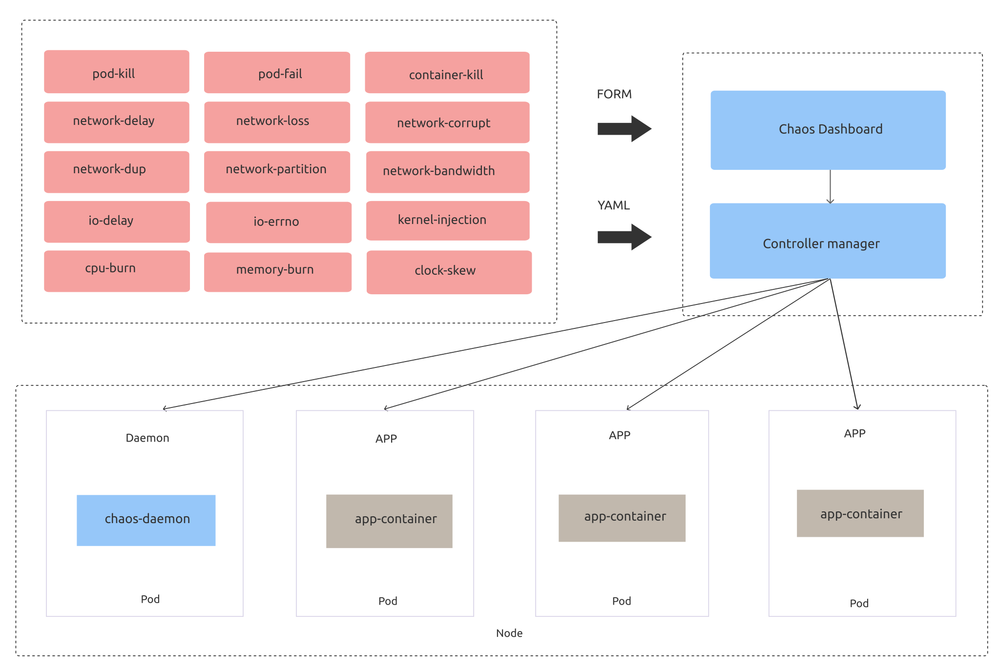

> **Note:**
>
> This readme and related documentation are Work in Progress.

Chaos Mesh® is a [Cloud Native Computing Foundation (CNCF)](https://www.cncf.io/) hosted project. It is a cloud-native Chaos Engineering platform that orchestrates chaos on Kubernetes environments. At the current stage, it has the following components:

- **Chaos Operator**: the core component for chaos orchestration. Fully open sourced.
- **Chaos Dashboard**: a Web UI for managing, designing, monitoring Chaos Experiments; under development.

See the following demo video for a quick view of Chaos Mesh:

## Chaos Operator

Chaos Operator injects chaos into the applications and Kubernetes infrastructure in a manageable way, which provides easy, custom definitions for chaos experiments and automatic orchestration. There are three components at play:

**Controller-manager**: used to schedule and manage the lifecycle of CRD objects

**Chaos-daemon**: runs as daemonset with privileged system permissions over network, Cgroup, etc. for a specific node

Chaos Operator uses [Custom Resource Definition (CRD)](https://kubernetes.io/docs/tasks/access-kubernetes-api/custom-resources/custom-resource-definitions/) to define chaos objects.
The current implementation supports a few types of CRD objects for fault injection, namely DNSChaos, PodChaos, PodIoChaos, PodNetworkChaos, NetworkChaos, IoChaos, TimeChaos, StressChaos, and KernelChaos, which correspond to the following major actions (experiments):

- pod-kill: The selected pod is killed (ReplicaSet or something similar may be needed to ensure the pod will be restarted).
- pod-failure: The selected pod will be unavailable in a specified period of time.
- container-kill: The selected container is killed in the selected pod.
- netem chaos: Network chaos such as delay, duplication, etc.
- network-partition: Simulate network partition.
- IO chaos: Simulate file system faults such as I/O delay, read/write errors, etc.
- time chaos: The selected pod will be injected with clock skew.
- cpu-burn: Simulate the CPU of the selected pod stress.
- memory-burn: Simulate the memory of the selected pod stress.
- kernel chaos: The selected pod will be injected with (slab, bio, etc) errors.
- dns chaos: The selected pod will be injected with dns errors, such as error, random.

## Quick start

- [Get Started on kind](https://chaos-mesh.org/docs/get_started/get_started_on_kind)
- [Get Started on minikube](https://chaos-mesh.org/docs/get_started/get_started_on_minikube)

## Deploy and use

See [Docs](https://chaos-mesh.org/docs/).

## Adopters

See [ADOPTERS](ADOPTERS.md).

## Blogs

Blogs on Chaos Mesh design & implementation, features, chaos engineering, community updates, etc. See [Chaos Mesh Blogs](https://chaos-mesh.org/blog). Here are some recommended ones for you to start with:

- [Chaos Mesh - Your Chaos Engineering Solution for System Resiliency on Kubernetes](https://pingcap.com/blog/chaos-mesh-your-chaos-engineering-solution-for-system-resiliency-on-kubernetes/)
- [Run Your First Chaos Experiment in 10 Minutes](https://pingcap.com/blog/run-first-chaos-experiment-in-ten-minutes/)
- [Simulating Clock Skew in K8s Without Affecting Other Containers on the Node](https://pingcap.com/blog/simulating-clock-skew-in-k8s-without-affecting-other-containers-on-node/)
- [Building an Automated Testing Framework Based on Chaos Mesh® and Argo](https://chaos-mesh.org/blog/building_automated_testing_framework)
- [Chaos Mesh 1.0: Chaos Engineering on Kubernetes Made Easier](https://chaos-mesh.org/blog/chaos-mesh-1.0-chaos-engineering-on-kubernetes-made-easier)

## Contribute

See the [contributing guide](./CONTRIBUTING.md) and [development guide](https://chaos-mesh.org/docs/development_guides/development_overview).

## Community

Please reach out for bugs, feature requests, and other issues via:

- Following us on Twitter at [@chaos_mesh](https://twitter.com/chaos_mesh).
- Joining the #project-chaos-mesh channel in the [CNCF Slack](https://cloud-native.slack.com/join/shared_invite/zt-lo88vmyc-9e3jSdUXf3dLP2yKql4A0Q#/) workspace.
- Filing an issue or opening a PR against this repository.

### Community meeting

On the fourth Thursday of every month (unless otherwise specified), the Chaos Mesh community holds a monthly meeting by video conference to discuss the status of Chaos Mesh.

**Quick links:**

- [Meeting notes](https://docs.google.com/document/d/1H8IfmhIJiJ1ltg-XLjqR_P_RaMHUGrl1CzvHnKM_9Sc/edit?usp=sharing)
- [Zoom meeting link](https://zoom.us/j/91354182294)

### Community blog

- Grant Tarrant-Fisher: [Integrate your Reliability Toolkit with Your World, Part 2](https://medium.com/chaosiq/integrate-your-reliability-toolkit-with-your-world-part-2-e012f2c2a7f6)
- Yoshinori Teraoka: [Streake: Chaos Mesh によるカオスエンジニアリング](https://medium.com/sreake-jp/chaos-mesh-%E3%81%AB%E3%82%88%E3%82%8B%E3%82%AB%E3%82%AA%E3%82%B9%E3%82%A8%E3%83%B3%E3%82%B8%E3%83%8B%E3%82%A2%E3%83%AA%E3%83%B3%E3%82%B0-46fa2897c742)
- Sébastien Prud'homme: [Chaos Mesh : un générateur de chaos pour Kubernetes](https://www.cowboysysop.com/post/chaos-mesh-un-generateur-de-chaos-pour-kubernetes/)
- Craig Morten
  - [K8s Chaos Dive: Chaos-Mesh Part 1](https://dev.to/craigmorten/k8s-chaos-dive-2-chaos-mesh-part-1-2i96)
  - [K8s Chaos Dive: Chaos-Mesh Part 2](https://dev.to/craigmorten/k8s-chaos-dive-chaos-mesh-part-2-536m)
- Ronak Banka: [Getting Started with Chaos Mesh and Kubernetes](https://itnext.io/getting-started-with-chaos-mesh-and-kubernetes-bfd98d25d481)
- kondoumh: [​Kubernetes ネイティブなカオスエンジニアリングツール Chaos Mesh を使ってみる](https://blog.kondoumh.com/entry/2020/10/23/123431)
- Vadim Tkachenko: [ChaosMesh to Create Chaos in Kubernetes](https://www.percona.com/blog/2020/11/05/chaosmesh-to-create-chaos-in-kubernetes/)
- Hui Zhang: [How a Top Game Company Uses Chaos Engineering to Improve Testing](https://chaos-mesh.org/blog/how-a-top-game-company-uses-chaos-engineering-to-improve-testing)

## Media coverage

- CodeZine: [オープンソースのカオステストツール「Chaos Mesh 1.0」、一般提供を開始](https://codezine.jp/article/detail/12996)
- @IT atmarkit: [Kubernetes 向けカオスエンジニアリングプラットフォーム「Chaos Mesh 1.0」が公開](https://www.atmarkit.co.jp/ait/articles/2010/09/news108.html)
- Publickey: [Kubernetes の Pod やネットワークをわざと落としまくってカオスエンジニアリングのテストができる「Chaos Mesh」がバージョン 1.0 に到達](https://www.publickey1.jp/blog/20/kubernetespodchaos_mesh10.html)
- InfoQ: [Chaos Engineering on Kubernetes : Chaos Mesh Generally Available with v1.0](https://www.infoq.com/news/2020/10/kubernetes-chaos-mesh-ga/)
- TechGenix: [Chaos Mesh Promises to Bring Order to Chaos Engineering](http://techgenix.com/chaos-mesh-chaos-engineering/)

## FAQs

See [FAQs](https://chaos-mesh.org/docs/faqs).

## Roadmap

See [ROADMAP](./ROADMAP.md).

## License

Chaos Mesh is licensed under the Apache License, Version 2.0. See [LICENSE](./LICENSE) for the full license text.

## Trademark

Chaos Mesh® is a trademark of The Linux Foundation. All rights reserved.
