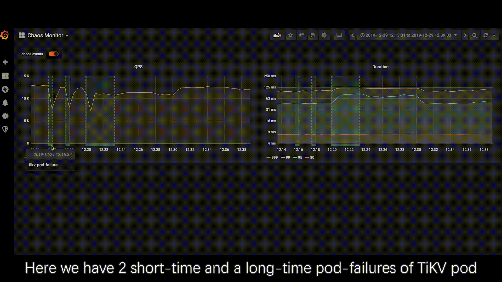
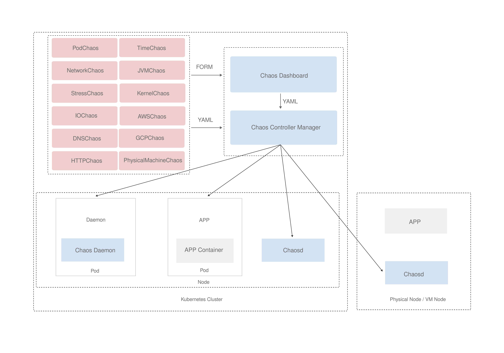

---

<!-- markdown-link-check-disable -->

<!-- markdown-link-check-enable -->

Chaos Mesh is an open source cloud-native Chaos Engineering platform. It offers various types of fault simulation and has an enormous capability to orchestrate fault scenarios.

Using Chaos Mesh, you can conveniently simulate various abnormalities that might occur in reality during the development, testing, and production environments and find potential problems in the system. To lower the threshold for a Chaos Engineering project, Chaos Mesh provides you with a visualization operation. You can easily design your Chaos scenarios on the Web UI and monitor the status of Chaos experiments.

Chaos Mesh is a [Cloud Native Computing Foundation (CNCF)](https://www.cncf.io/) incubating project. If you are an organization that wants to help shape the evolution of technologies that are container-packaged, dynamically-scheduled and microservices-oriented, consider joining the CNCF. For details about who's involved and how Chaos Mesh plays a role, read the CNCF [announcement](https://www.cncf.io/announcements/2020/09/02/cloud-native-computing-foundation-announces-tikv-graduation/).

---

At the current stage, Chaos Mesh has the following components:

- **Chaos Operator**: the core component for chaos orchestration. Fully open sourced.
- **Chaos Dashboard**: a Web UI for managing, designing, monitoring Chaos Experiments.

See the following demo video for a quick view of Chaos Mesh:

## Chaos Operator

Chaos Operator injects chaos into the applications and Kubernetes infrastructure in a manageable way, which provides easy, custom definitions for chaos experiments and automatic orchestration. There are three components at play:

**Controller-manager**: used to schedule and manage the lifecycle of CRD objects.

**Chaos-daemon**: runs as daemonset with privileged system permissions over network, Cgroup, etc. for a specific node.

Chaos Operator uses [CustomResourceDefinition (CRD)](https://kubernetes.io/docs/tasks/access-kubernetes-api/custom-resources/custom-resource-definitions/) to define chaos objects.
The current implementation supports a few types of CRD objects for fault injection, namely DNSChaos, PodChaos, PodIOChaos, PodNetworkChaos, NetworkChaos, IOChaos, TimeChaos, StressChaos, and KernelChaos, which correspond to the following major actions (experiments):

- pod-kill: The selected pod is killed (ReplicaSet or something similar may be needed to ensure the pod will be restarted).
- pod-failure: The selected pod will be unavailable in a specified period of time.
- container-kill: The selected container is killed in the selected pod.
- netem chaos: Network chaos such as delay, duplication, etc.
- network-partition: Simulate network partition.
- IO chaos: Simulate file system faults such as I/O delay, read/write errors, etc.
- time chaos: The selected pod will be injected with clock skew.
- cpu-burn: Simulate the CPU of the selected pod stress.
- memory-burn: Simulate the memory of the selected pod stress.
- kernel chaos: The selected pod will be injected with (slab, bio, etc) errors.
- dns chaos: The selected pod will be injected with dns errors, such as error, random.

## Quick start

See [Chaos Mesh Docs](https://chaos-mesh.org/docs/).

## Adopters

See [ADOPTERS](ADOPTERS.md).

## Blogs

Blogs on Chaos Mesh design & implementation, features, chaos engineering, community updates, etc. See [Chaos Mesh Blogs](https://chaos-mesh.org/blog). Here are some recommended ones for you to start with:

- [Chaos Mesh 2.0: To a Chaos Engineering Ecology](https://chaos-mesh.org/blog/chaos-mesh-2.0-to-a-chaos-engineering-ecology/)
- [Chaos Mesh - Your Chaos Engineering Solution for System Resiliency on Kubernetes](https://chaos-mesh.org/blog/chaos_mesh_your_chaos_engineering_solution/)
- [Run Your First Chaos Experiment in 10 Minutes](https://chaos-mesh.org/blog/run_your_first_chaos_experiment/)
- [How to Simulate I/O Faults at Runtime](https://chaos-mesh.org/blog/how-to-simulate-io-faults-at-runtime/)
- [Simulating Clock Skew in K8s Without Affecting Other Containers on the Node](https://chaos-mesh.org/blog/simulating-clock-skew-in-k8s-without-affecting-other-containers-on-node/)
- [Building an Automated Testing Framework Based on Chaos Mesh and Argo](https://chaos-mesh.org/blog/building_automated_testing_framework)

## Contributing

See the [contributing guide](./CONTRIBUTING.md) and [development guide](https://chaos-mesh.org/docs/developer-guide-overview).

## Community

Please reach out for bugs, feature requests, and other issues via:

- Following us on Twitter [@chaos_mesh](https://twitter.com/chaos_mesh).

- Joining the #project-chaos-mesh channel in the [CNCF Slack](https://slack.cncf.io/) workspace.

- Filing an issue or opening a PR against this repository.

### Community meetings

- Chaos Mesh Community Monthly (Community and project-level updates, community sharing/demo, office hours)
  - Time: on the fourth Thursday of every month (unless otherwise specified)
  - [RSVP here](https://community.cncf.io/chaos-mesh-community/)
  - [Meeting minutes](https://docs.google.com/document/d/1H8IfmhIJiJ1ltg-XLjqR_P_RaMHUGrl1CzvHnKM_9Sc/edit?usp=sharing)

- Chaos Mesh Development Meeting (Releases, roadmap/features/RFC planning and discussion, issue triage/discussion, etc)
  - Time: Every other Tuesday (unless otherwise specified)
  - [RSVP here](https://community.cncf.io/chaos-mesh-community/)
  - [Meeting minutes](https://docs.google.com/document/d/1s9X6tTOy3OGZaLDZQesGw1BNOrxQfWExjBFIn5irpPE/edit#heading=h.94nzmll6m8n5)

### Community blogs

- Grant Tarrant-Fisher: [Integrate your Reliability Toolkit with Your World](https://medium.com/search?q=Integrate+your+Reliability+Toolkit+with+Your+World)
- Yoshinori Teraoka: [Streake: Chaos Mesh によるカオスエンジニアリング](https://medium.com/sreake-jp/chaos-mesh-%E3%81%AB%E3%82%88%E3%82%8B%E3%82%AB%E3%82%AA%E3%82%B9%E3%82%A8%E3%83%B3%E3%82%B8%E3%83%8B%E3%82%A2%E3%83%AA%E3%83%B3%E3%82%B0-46fa2897c742)
- Sébastien Prud'homme: [Chaos Mesh : un générateur de chaos pour Kubernetes](https://www.cowboysysop.com/post/chaos-mesh-un-generateur-de-chaos-pour-kubernetes/)
- Craig Morten
  - [K8s Chaos Dive: Chaos-Mesh Part 1](https://dev.to/craigmorten/k8s-chaos-dive-2-chaos-mesh-part-1-2i96)
  - [K8s Chaos Dive: Chaos-Mesh Part 2](https://dev.to/craigmorten/k8s-chaos-dive-chaos-mesh-part-2-536m)
- Ronak Banka: [Getting Started with Chaos Mesh and Kubernetes](https://itnext.io/getting-started-with-chaos-mesh-and-kubernetes-bfd98d25d481)
- kondoumh: [​Kubernetes ネイティブなカオスエンジニアリングツール Chaos Mesh を使ってみる](https://blog.kondoumh.com/entry/2020/10/23/123431)
- Vadim Tkachenko: [ChaosMesh to Create Chaos in Kubernetes](https://www.percona.com/blog/2020/11/05/chaosmesh-to-create-chaos-in-kubernetes/)
- Hui Zhang: [How a Top Game Company Uses Chaos Engineering to Improve Testing](https://chaos-mesh.org/blog/how-a-top-game-company-uses-chaos-engineering-to-improve-testing)
- Anurag Paliwal
  - [Securing tenant services while using chaos mesh using OPA](https://anuragpaliwal-93749.medium.com/securing-tenant-services-while-using-chaos-mesh-using-opa-3ae80c7f4b85)
  - [Securing namespaces using restrict authorization feature in chaos mesh](https://anuragpaliwal-93749.medium.com/securing-namespaces-using-restrict-authorization-feature-in-chaos-mesh-2e110c3e0fb7)
- Pavan Kumar: [Chaos Engineering in Kubernetes using Chaos Mesh](https://link.medium.com/1V90dEknugb)
- Jessica Cherry: [Test your Kubernetes experiments with an open source web interface](https://opensource.com/article/21/6/chaos-mesh-kubernetes)
- λ.eranga: [Chaos Engineering with Chaos Mesh](https://medium.com/rahasak/chaos-engineering-with-chaos-mesh-b040169b51bd)
- Tomáš Kubica: [Kubernetes prakticky: zlounství s Chaos Mesh a Azure Chaos Studio](https://www.tomaskubica.cz/post/2021/kubernetes-prakticky-zlounstvi-s-chaos-mesh-a-azure-chaos-studio2/)
- mend: [Chaos Meshで何ができるのか見てみた](https://qiita.com/mend/items/dcdfab5e980467bf58e9)

### Community talks

- Twain Taylor: [Chaos Mesh Simplifies & Organizes Chaos Engineering For Kubernetes](https://youtu.be/shbrjAY86ZQ)
- Saiyam Pathak
  - [Let's explore chaos mesh](https://youtu.be/kMbTYItsTTI)
  - [Chaos Mesh - Chaos Engineering for Kubernetes](https://youtu.be/HAU_cjW1bMw)
  - [Chaos Mesh 2.0](https://youtu.be/HmQ9cFwxF7g)

## Media coverage

- CodeZine: [オープンソースのカオステストツール「Chaos Mesh 1.0」、一般提供を開始](https://codezine.jp/article/detail/12996)
- @IT atmarkit: [Kubernetes 向けカオスエンジニアリングプラットフォーム「Chaos Mesh 1.0」が公開](https://www.atmarkit.co.jp/ait/articles/2010/09/news108.html)
- Publickey: [Kubernetes の Pod やネットワークをわざと落としまくってカオスエンジニアリングのテストができる「Chaos Mesh」がバージョン 1.0 に到達](https://www.publickey1.jp/blog/20/kubernetespodchaos_mesh10.html)
- InfoQ: [Chaos Engineering on Kubernetes : Chaos Mesh Generally Available with v1.0](https://www.infoq.com/news/2020/10/kubernetes-chaos-mesh-ga/)
- TechGenix: [Chaos Mesh Promises to Bring Order to Chaos Engineering](http://techgenix.com/chaos-mesh-chaos-engineering/)

## FAQs

See [FAQs](https://chaos-mesh.org/docs).

## Roadmap

See [ROADMAP](./ROADMAP.md).

## License

Chaos Mesh is licensed under the Apache License, Version 2.0. See [LICENSE](./LICENSE) for the full license text.

<!-- markdown-link-check-disable-next-line -->

## Trademark

Chaos Mesh is a trademark of The Linux Foundation. All rights reserved.
