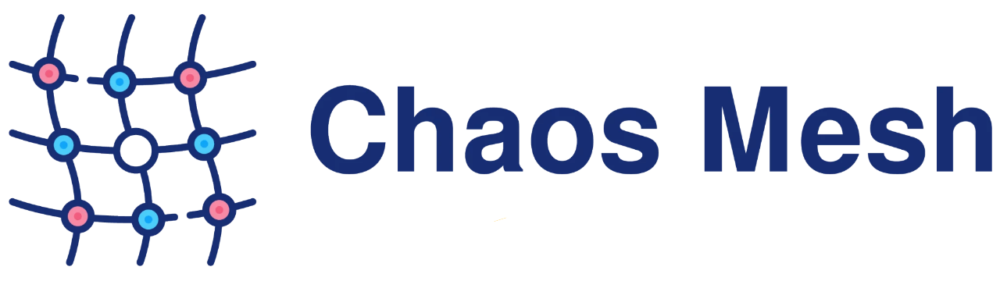
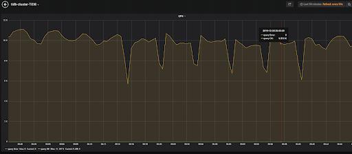

[](https://internal.pingcap.net/idc-jenkins/view/chaos-mesh/job/build_chaos_mesh_master/)
[](https://codecov.io/gh/pingcap/chaos-mesh)
[](https://github.com/pingcap/chaos-mesh/blob/master/LICENSE)
[](https://golang.org/)
[](https://goreportcard.com/report/github.com/pingcap/chaos-mesh)
[](https://godoc.org/github.com/pingcap/chaos-mesh)

> **Note:**
>
> This readme and related documentation are Work in Progress.

Chaos Mesh is a cloud-native Chaos Engineering platform that orchestrates chaos on Kubernetes environments. At the current stage, it has the following components:

- **Chaos Operator**: the core component for chaos orchestration. Fully open sourced.
- **Chaos Dashboard**: a visualized panel that shows the impacts of chaos experiments on the online services of the system; under development; 
curently only supports chaos experiments on TiDB(https://github.com/pingcap/tidb).

See the following demo video for a quick view of Chaos Mesh:

[](https://www.youtube.com/watch?v=ifZEwdJO868)

## Chaos Operator

Chaos Operator injects chaos into the applications and Kubernetes infrastructure in a manageable way, which provides easy, 
custom definitions for chaos experiments and automatic orchestration. There are three components at play:

**Controller-manager**: used to schedule and manage the lifecycle of CRD objects

**Chaos-daemon**: runs as daemonset with privileged system permissions over network, Cgroup, etc. for a specifc node

**Sidecar**: a special type of container that is dynamically injected into the target Pod by the webhook-server, which can be used for hijacking I/O of the application container.


Chaos Operator uses [Custom Resource Definition (CRD)](https://kubernetes.io/docs/tasks/access-kubernetes-api/custom-resources/custom-resource-definitions/) to define chaos objects. 
The current implementation supports three types of CRD objects for fault injection, namely PodChaos, NetworkChaos, IOChaos, and TimeChaos, 
which correspond to the following major actions (experiments):

- pod-kill: The selected pod is killed (ReplicaSet or something similar may be needed to ensure the pod will be restarted).
- pod-failure: The selected pod will be unavailable in a specified period of time.
- container-kill: The selected container of pod is killed.
- netem chaos: Network chaos such as delay, duplication, etc.
- network-partition: Simulate network partition.
- IO chaos: Simulate file system faults such as I/O delay, read/write errors, etc.
- Time chaos: Modify the time obtained by the application to achieve the effect of time skew.

## Quick Start

### Prerequisites

Before deploying Chaos Mesh, make sure the following items have been installed. 
If you would like to have a try on your machine, you can refer to [get-started-on-your-local-machine](#get-started-on-your-local-machine) section.

- Kubernetes >= v1.12
- [RBAC](https://kubernetes.io/docs/admin/authorization/rbac) enabled (optional)
- [Helm](https://helm.sh/) version >= v2.8.2
- [Docker](https://docs.docker.com/install/) (required when running in [kind](https://kind.sigs.k8s.io/))

### Get the Helm files

```bash
git clone https://github.com/pingcap/chaos-mesh.git
cd chaos-mesh/
```

### Install Chaos Mesh

```bash
./install.sh 
```

`install.sh` will help you to install `kubelet`, `Helm`, and `Chaos Mesh`. 
If you want to use Chaos Mesh on your local environment with `kind`, you can use `install.sh` with `--local kind` flag field, 
this script will help you install `kind` and setup a local Kubernetes cluster before installing Chaos Mesh.

At present, `install.sh` only supports deploying Chaos Mesh locally using [kind](https://kind.sigs.k8s.io/).
If you want to deploy Chaos Mesh using [minikube](https://kubernetes.io/docs/tasks/tools/install-minikube/), this doc [get stated on minikube](./doc/get_started_on_minikube.md) can help you.

After executing the above command, if the message that Chaos Mesh is installed 
successfully is output normally, then you can continue next steps to test your application and enjoy Chaos Mesh. 
Otherwise, please check the current environment according to the prompt message of the script 
or send us an [issue](https://github.com/pingcap/chaos-mesh/issues/new/choose) for help. 
In addition, You also can use [Helm](https://helm.sh/) to [install Chaos Mesh manually](./doc/install_chaos_mesh_manually.md).


### Deploy target cluster

After Chaos Mesh is deployed, we can deploy the target cluster to be tested, or where we want to inject faults. For illustration purposes, we use TiDB as our sample cluster.

You can follow the instructions in the following two documents to deploy a TiDB cluster:

* [Deploy using kind](https://pingcap.com/docs/stable/tidb-in-kubernetes/get-started/deploy-tidb-from-kubernetes-kind/)
* [Deploy using minikube](https://pingcap.com/docs/stable/tidb-in-kubernetes/get-started/deploy-tidb-from-kubernetes-minikube/)

### Define chaos experiment config file

The chaos experiment configuration is defined in a .yaml file. The following sample file (`pod-kill-example.yaml`) defines a chaos experiment to kill one tikv pod randomly every 60 seconds:

```yaml
apiVersion: pingcap.com/v1alpha1
kind: PodChaos
metadata:
  name: pod-failure-example
  namespace: chaos-testing
spec:
  action: pod-failure # the specific chaos action to inject; supported actions: pod-kill/pod-failure
  mode: one # the mode to run chaos action; supported modes are one/all/fixed/fixed-percent/random-max-percent
  duration: "60s" # duration for the injected chaos experiment
  selector: # pods where to inject chaos actions
    namespaces:
      - tidb-cluster-demo  # the namespace of the system under test (SUT) you've deployed
    labelSelectors:
      "app.kubernetes.io/component": "tikv" # the label of the pod for chaos injection
  scheduler: # scheduler rules for the running time of the chaos experiments about pods.
    cron: "@every 5m"
```

### Create a chaos experiment

```bash
kubectl apply -f pod-failure-example.yaml
kubectl get podchaos --namespace=chaos-testing
```

You can see the QPS performance (by [running a benchmark against the cluster](https://pingcap.com/docs/stable/benchmark/how-to-run-sysbench/) affected by the chaos experiment from TiDB Grafana dashboard:



### Update a chaos experiment

```bash
vim pod-failure-example.yaml # modify pod-failure-example.yaml to what you want
kubectl apply -f pod-failure-example.yaml
```

### Delete a chaos experiment

```bash
kubectl delete -f pod-failure-example.yaml
```

### Watch your chaos experiments in Dashboard

Chaos Dashboard is currently only available for TiDB clusters. Stay tuned for more supports or join us in making it happen.

> **Note:**
>
> If Chaos Dashboard was not installed in your earlier deployment, you need to install it by upgrading Chaos Mesh:
>
> ```helm upgrade chaos-mesh helm/chaos-mesh --namespace=chaos-testing --set dashboard.create=true```

A typical way to access it is to use `kubectl port-forward`

```bash
kubectl port-forward -n chaos-testing svc/chaos-dashboard 8080:80
```

Then you can access [`http://localhost:8080`](http://localhost:8080) in browser.

## FAQs

Refer to [FAQs](/doc/faqs.md).

## Community

Please reach out for bugs, feature requests, and other issues via:

- Following us on Twitter at [@chaos_mesh](https://twitter.com/chaos_mesh).
- The #sig-chaos-mesh channel in the [TiDB Community](https://pingcap.com/tidbslack) slack workspace.
- Filing a issue or opening a PR against this repo.

## Roadmap

See [ROADMAP](/ROADMAP.md)

## License

Chaos Mesh is licensed under the Apache License, Version 2.0. See [LICENSE](/LICENSE) for the full license text.
