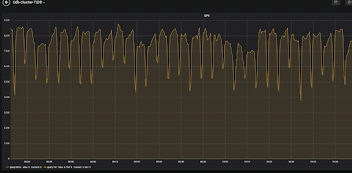
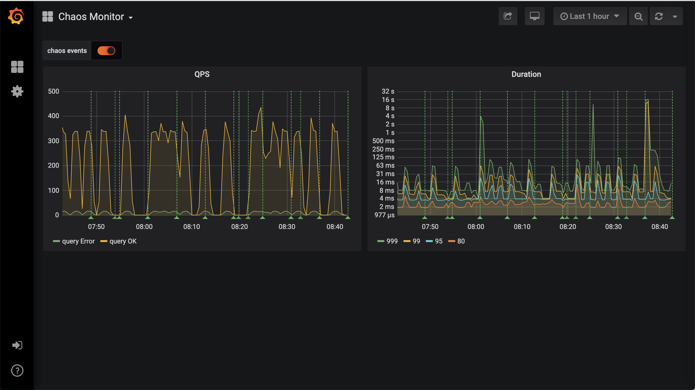

# Chaos Mesh

Chaos Mesh is an open source project that provides powerful chaos engineering platform for kubernetes. 

At present stage it has two parts: Chaos Operator and Chaos Dashboard. Chaos Operator is available now. You can just install Chaos Operator to implement chaos operations. Chaos Dashboard is under development. Now, it can show the impact of chaos to TiDB Cluster\(other targets such as etcd need some configurations\).

## Chaos Operator

Chaos Operator is used to inject chaos into the applications and Kubernetes infrastructure in a manageable way, which provides easy definitions for chaos experiments and automates the execution of chaos experiments.


### Deploy

#### Prerequisites

Before deploying Chaos Mesh, make sure the following items are installed on your machine:

* Kubernetes >= v1.12 and < v1.16
* [RBAC](https://kubernetes.io/docs/admin/authorization/rbac) enabled (optional)
* [Helm](https://helm.sh/) version >= v2.8.2 and < v3.0.0

#### Install

##### Get the Helm files

```bash
git clone https://github.com/pingcap/chaos-mesh.git
cd chaos-mesh/
```

##### Create custom resource type

Chaos Mesh uses [CRD (Custom Resource Definition)](https://kubernetes.io/docs/tasks/access-kubernetes-api/custom-resources/custom-resource-definitions/) 
to extend Kubernetes. Therefore, to use Chaos Mesh, you must first create the related custom resource type.

```bash
kubectl apply -f manifests/
kubectl get crd podchaos.pingcap.com
```

##### Install Chaos Mesh

* Install Chaos Mesh with Chaos Operator only

```bash
helm install helm/chaos-mesh --name=chaos-mesh --namespace=chaos-testing
kubectl get pods --namespace chaos-testing -l app.kubernetes.io/instance=chaos-mesh
```

* Install Chaos Mesh with Chaos Operator and Chaos Dashboard

```bash
helm install helm/chaos-mesh --name=chaos-mesh --namespace=chaos-testing --set dashboard.create=true
```

### Get Started on your local machine

**This deployment is for testing only. DO NOT USE in production!**

You can try Chaos Mesh on you local K8s envirement deployed using `kind` or `minikube`.

#### Deploy with `kind`

1. Clone the code:

   ```bash
   git clone --depth=1 https://github.com/pingcap/chaos-mesh && \
   cd chaos-mesh
   ```

2. Run the script and create a local Kubernetes cluster:

   ```bash
   hack/kind-cluster-build.sh
   ```

3. To connect the local Kubernetes cluster, set the default configuration file path of kubectl to `kube-config`.

   ```bash
   export KUBECONFIG="$(kind get kubeconfig-path)"
   ```

4. Verify whether the Kubernetes cluster is on and running:

   ```bash
   kubectl cluster-info
   ```

Then you can install `chaos-mesh` on `kind` kubernetes cluster as suggested above.

#### Deploy with `minikube`

1. Start a `minikube` kubernetes cluster

   ```bash
   minikube start --kubernetes-version v1.15.0 --cpus 4 --memory "8192mb" // we recommend that you allocate enough RAM(better more than 8192 MiB) to VM
   ```

2. Install helm

   ```bash
   curl https://raw.githubusercontent.com/helm/helm/master/scripts/get | bash
   helm init
   ```

3. Check whether helm tiller pod is running

   ```bash
   kubectl -n kube-system get pods -l app=helm
   ```

After helm tiller pod is running, you can install `chaos-operator` like suggested above.

#### Warning

There are still some restrictions for `chaos-operator` on `kind` and `minikube` clusters.

1. Network related chaos is not supported on `kind` clusters.

   This is because we use docker pkg to transform between container id and  pid, which is necessary to find network namespace for pods. `kind` uses `containerd` as CRI runtime and it's not supported yet.

   More CRI runtime can be supported in the future. Wait for you contribution :)

2. Network delay, loss, etc are not supported on `minikube` clusters. That's because `minikube` default virtual machine driver's image doesn't contain `sch_netem` kernel module. You can use `none` driver (if your host is Linux and has loaded `sch_netem` kernel module) to try these chaos on `minikube` or [build a image with `sch_netem` by yourself](https://minikube.sigs.k8s.io/docs/contributing/iso/)

### Usage

#### Define chaos experiment config file

eg: define a chaos experiment to kill one tikv pod randomly

create a chaos experiment file and name it `pod-kill-example.yaml`.

> TiDB cluster named `tidb-cluster-demo` must be installed before applying this chaos experiment.   
> For the installation of the TiDB cluster, see [deploy tidb cluster](#deploy-tidb-cluster)

```yaml
apiVersion: pingcap.com/v1alpha1
kind: PodChaos
metadata:
  name: pod-kill-example
  namespace: chaos-testing
spec:
  action: pod-kill
  mode: one
  selector:
    namespaces:
      - tidb-cluster-demo
    labelSelectors:
      "app.kubernetes.io/component": "tikv"
  scheduler:
    cron: "@every 2m"
```

##### PodChaos

PodChaos designs for the chaos experiments about pods.

* **action** defines the specific pod chaos action, supported action: pod-kill / pod-failure
* **mode** defines the mode to run chaos action, supported mode: one / all / fixed / fixed-percent / random-max-percent
* **selector** is used to select pods that are used to inject chaos action.
* **scheduler** defines some scheduler rules to the running time of the chaos experiment about pods.
More cron rule info: https://godoc.org/github.com/robfig/cron

more examples: [https://github.com/pingcap/chaos-mesh/tree/master/examples](https://github.com/pingcap/chaos-mesh/tree/master/examples)

#### Create a chaos experiment

```bash
kubectl apply -f pod-kill-example.yaml
kubectl get podchaos --namespace=chaos-testing
```

We can see the QPS performance affected by the chaos experiment from TiDB Grafana dashboard: 



#### Update a chaos experiment

```bash
vim pod-kill-example.yaml
kubectl apply -f pod-kill-example.yaml
```

#### Delete a chaos experiment

```bash
kubectl delete -f pod-kill-example.yaml
```

### Additional

There are multiple kinds of chaos supported now.

* pod-kill, pod-kill will simply kill selected pods. To ensure pod will be restarted again, ReplicaSet (or something similar) may be needed to guard it.
* pod-fail, pod-fail means the process will not be alive in a period of time but the pod still exists.
* netem chaos, netem chaos contains some kind of chaos. such as delay, duplicate etc. You can find more in example
* network partition, network partition can decompose pods into several independent subnets by blocking communication between them.
* IO chaos, IO delay means you can specify the latency before the io operation will return. IO errno means your read/write IO operation will return error.

## Chaos Dashboard

Chaos dashboard can be used to visualize chaos events. However, it **only** supports tidb now (so it isn't installed by default).

### Install Chaos Dashboard

```bash
helm install helm/chaos-mesh --name=chaos-mesh --namespace=chaos-testing --set dashboard.create=true
```

If Chaos operator was installed, we need to upgrade it:

```bash
helm upgrade helm/chaos-mesh --name=chaos-mesh --namespace=chaos-testing --set dashboard.create=true
```

Then `svc/chaos-dashboard` will be created under `chaos-testing` namespace and you can access `chaos-dashboard` through it. The typical way to access it is to use `kubectl port-forward`

```bash
kubectl port-forward -n chaos-testing svc/chaos-dashboard 8080:80
```

Then you can access [`chaos-dashboard`](http://localhost:8080) in browser.

### Deploy TiDB cluster

You can follow these two document links to deploy a TiDB cluster.

* [if use kind](https://pingcap.com/docs/stable/tidb-in-kubernetes/get-started/deploy-tidb-from-kubernetes-kind/)
* [if use minikube](https://pingcap.com/docs/stable/tidb-in-kubernetes/get-started/deploy-tidb-from-kubernetes-minikube/)

### Run a chaos testing on TiDB cluster

You can refer to the [Usage](#Usage) part, try different kinds of chaos actions supported now.

[](https://www.youtube.com/watch?v=yzhvKKL8uJk)
