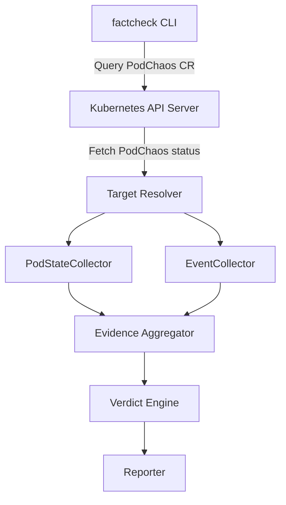

# Chaos Mesh Runtime Fact Checker

This directory contains a prototype CLI for runtime fact checking of Chaos Mesh experiments.

## Current scope

The current implementation supports verification of `PodChaos` with the `pod-kill` action only.

The tool is a standalone CLI that:
- fetches a `PodChaos` resource from the cluster
- resolves the target pods from the CR status
- collects evidence from Kubernetes pod state and events
- generates a verdict and a report in text or JSON format

## Usage

Build the CLI from the repository root:

```bash
cd cmd/factcheck
go build -o factcheck main.go
```

Run the CLI against a `PodChaos` resource:

```bash
./factcheck --name=<chaos-name> --namespace=<namespace> --kind=PodChaos --output=text
```

Supported flags:
- `-name` — name of the Chaos CR (required)
- `-namespace` — namespace of the Chaos CR (default: `default`)
- `-kind` — kind of the Chaos CR (`PodChaos` only for now)
- `-output` — output format (`text` or `json`)

## Behavior

The current proof-of-concept detects pod-kill evidence using two collectors:
- `PodStateCollector`: checks whether the target pod was deleted or recreated after the chaos injection
- `EventCollector`: checks for `Killing` events for the target pod

The verifier polls for evidence during a short time window after the target is resolved. Once sufficient evidence is found for a target pod, the CLI reports a matched verdict for that target.

## Architecture

The tool is intended to be a prototype for runtime verification. A future generation may run as an in-cluster daemon using watchers and informers instead of the current polling-based design.



## Limitations

- Only `PodChaos` with `pod-kill` is supported.
- The current implementation is polling-based and intended as a prototype.
- DNSChaos and NetworkChaos are not supported in this directory yet.
- The tool does not yet include a persistent in-cluster watcher or daemon mode.

## Future work

Potential next steps include:
- adding support for additional PodChaos actions such as `container-kill` and `pod-failure`
- adding DNSChaos and NetworkChaos support with active probes
- adding an in-cluster daemon mode using Kubernetes informers to avoid polling
- improving evidence reporting and structured output for CI integration
